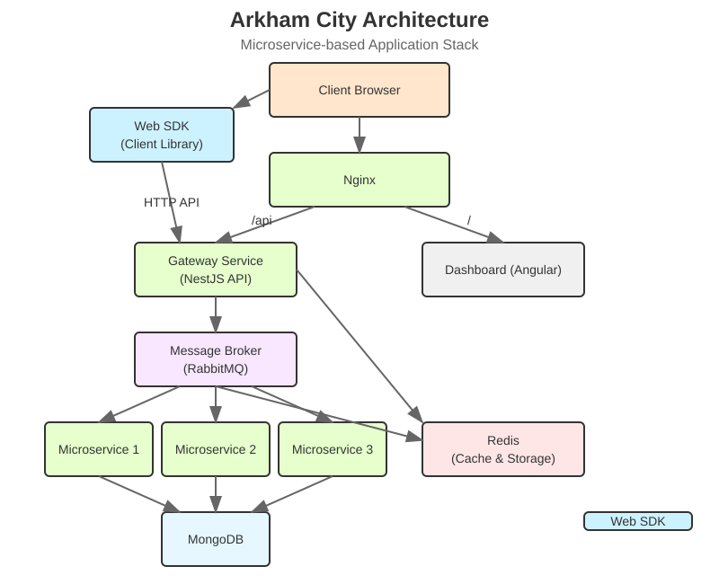

<p align="center">
  
</p>



## Overview

Arkham City is a modern, scalable application built on a microservice architecture. It provides a robust platform for
managing and analyzing data with a user-friendly dashboard interface. The system is designed for high performance,
reliability, and ease of deployment using containerization.

## Deployment

This repository contains Docker configuration files for deploying the Arkham City application stack.

## Components

The deployment consists of the following components:

1. **Gateway Service**: A NestJS application that serves as the API gateway.
2. **Microservices**: Three instances of the NestJS application running in microservice mode.
3. **Dashboard**: An Angular web application for the user interface.
4. **Nginx**: A web server that serves the dashboard and routes API requests to the gateway.
5. **MongoDB**: A database for storing application data.
6. **RabbitMQ**: A message broker for communication between services.
7. **Redis**: Used for caching and other temporary storage needs.

## Deployment Instructions

### Prerequisites

- Docker and Docker Compose installed on your system
- Git repository cloned to your local machine

### Steps to Deploy

1. Build and start all services:

```bash
docker-compose up -d
```

2. To view logs from all services:

```bash
docker-compose logs -f
```

3. To view logs from a specific service:

```bash
docker-compose logs -f <service-name>
```

Where `<service-name>` can be one of: `gateway`, `microservice1`, `microservice2`, `microservice3`, `dashboard`,
`nginx`, `mongo`, `redis`, `rabbitmq`.

### Accessing the Application

- **Dashboard**: Access the web dashboard at http://localhost/
- **API**: Access the API directly at http://localhost:3000/ or through Nginx at http://localhost/api/

## Architecture

- The **Gateway Service** handles HTTP API requests and communicates with microservices via RabbitMQ.
- The **Microservices** process tasks asynchronously, communicating via RabbitMQ.
- The **Dashboard** provides a web interface for users.
- **Nginx** serves the dashboard and routes API requests to the gateway.
- **MongoDB** stores application data in two databases: metadata and firestore.
- **RabbitMQ** serves as a message broker for communication between services.
- **Redis** is used for caching and temporary storage.

## Configuration

The services are configured using environment variables defined in the docker-compose.yml file. You can modify these
variables to customize the deployment.

## Scaling

To scale the number of microservice instances:

```bash
docker-compose up -d --scale microservice1=3 --scale microservice2=3 --scale microservice3=3
```

This will start 3 instances of each microservice type.

## Development

This section provides information about the project structure, engines, frameworks, and development workflow.

### Git Clone Project

To get started with development, you first need to clone the repository:

```bash
# Clone the repository
git clone https://github.com/min3rd/arkham-city.git

# Navigate to the project directory
cd arkham-city
```

After cloning, you can set up the individual components as described in the Build/Configuration Instructions section.

### Project Structure

The repository is organized into several main components:

- **arkham-city-core**: Backend NestJS application
    - `src/config`: Configuration files
    - `src/core`: Core utilities and shared code
    - `src/gateway`: API endpoints (controllers)
    - `src/microservices`: Microservice implementations
    - `src/modules`: Business logic and services
    - `src/app.module.ts`: Main application module
    - `src/main.ts`: Application entry point
    - `src/service.module.ts`: Service module configuration

- **arkham-city-dashboard**: Frontend Angular application
    - `src/app`: Main application components
    - `src/core`: Core utilities and shared code
    - `src/modules`: Feature modules
    - `src/main.ts`: Application entry point
    - `src/styles.css`: Global styles
    - `src/index.html`: Main HTML template

- **arkham-city-websdk**: Web SDK for integration with Arkham City backend
- **arkham-city-examples**: Example code and templates
- **docs**: Documentation files

### Web SDK Integration

The Arkham City Web SDK provides a simple way for web applications to connect to the Arkham City backend services. It
offers a Firebase-like interface for authentication and data storage operations.

#### Installation

```bash
# Using npm
npm install arkham-city-websdk

# Using yarn
yarn add arkham-city-websdk
```

#### Configuration

Before using the SDK, you need to configure it with your project details:

```typescript
import { globalConfig } from 'arkham-city-websdk/dist/manager';

// Initialize the SDK in your app's entry point
globalConfig({
  url: 'http://your-arkham-city-backend-url',  // Backend URL
  version: 'v1',                               // API version
  projectId: 'your-project-id',                // Project ID from Arkham City dashboard
  appId: 'your-app-id',                        // App ID from Arkham City dashboard
  secretKey: 'your-secret-key',                // Secret key from Arkham City dashboard
  isProductionMode: true,                      // Set to false for development
});
```

#### Using Firestore

The SDK provides a Firestore-like interface for data operations:

```typescript
import { firestore } from 'arkham-city-websdk/dist/firestore';

// Query documents
firestore('collection-name')
  .select<InputType, OutputType>({ /* query parameters */ })
  .subscribe(result => {
    console.log('Query result:', result);
  });

// Get a document by ID
firestore('collection-name')
  .get<DocumentType>(documentId)
  .subscribe(document => {
    console.log('Document:', document);
  });

// Create a document
firestore('collection-name')
  .create<InputType, OutputType>(data)
  .subscribe(createdDocument => {
    console.log('Created document:', createdDocument);
  });

// Update a document
firestore('collection-name')
  .update<InputType, OutputType>(documentId, data)
  .subscribe(updatedDocument => {
    console.log('Updated document:', updatedDocument);
  });

// Delete a document
firestore('collection-name')
  .delete<boolean>(documentId)
  .subscribe(success => {
    console.log('Delete successful:', success);
  });
```

#### Authentication

The SDK also provides authentication capabilities:

```typescript
import { auth } from 'arkham-city-websdk/dist/auth';

// Register a new user
auth.register({
  email: 'user@example.com',
  password: 'password123',
  // Additional user data
})
  .subscribe(result => {
    console.log('Registration result:', result);
  });

// Log in
auth.login({
  email: 'user@example.com',
  password: 'password123',
})
  .subscribe(result => {
    console.log('Login result:', result);
  });

// Log out
auth.logout()
  .subscribe(success => {
    console.log('Logout successful:', success);
  });

// Get current user
const currentUser = auth.currentUser();
console.log('Current user:', currentUser);
```

For more detailed examples, see the **arkham-city-examples** directory.

### Engines and Frameworks

#### Backend (arkham-city-core)

- **Framework**: NestJS (v11.1.0) - A progressive Node.js framework
- **Language**: TypeScript (v5.8.3)
- **Database**: MongoDB with Mongoose (v8.13.2)
- **Message Broker**: RabbitMQ with amqplib (v0.10.8)
- **Caching**: Redis with ioredis (v5.6.0)
- **Authentication**: JWT with @nestjs/jwt (v11.0.0)
- **Testing**: Jest (v29.7.0)
- **Documentation**: Compodoc (v1.1.26)

#### Frontend (arkham-city-dashboard)

- **Framework**: Angular (v19.2.9)
- **Language**: TypeScript (v5.8.3)
- **UI Framework**: TailwindCSS (v4.1.5)
- **UI Components**: Preline (v3.0.1)
- **Internationalization**: Transloco (v7.6.1)
- **Icons**: @ng-icons/feather-icons (v31.3.0)
- **Data Tables**: datatables.net (v2.3.0)
- **Calendar**: vanilla-calendar-pro (v3.0.4)
- **Authentication**: jwt-decode (v4.0.0)
- **Testing**: Jasmine (v5.7.1) and Karma (v6.4.4)

### Architecture Overview

The application follows a microservice architecture:

1. **Gateway Layer**: Handles HTTP requests and routes them to appropriate services
    - Implemented as NestJS controllers in the `gateway` directory
    - Communicates with services via direct injection or message broker

2. **Service Layer**: Contains business logic
    - Implemented as NestJS services in the `modules` directory
    - Provides functionality to gateway and microservices

3. **Microservice Layer**: Processes tasks asynchronously
    - Implemented as NestJS microservices in the `microservices` directory
    - Communicates via RabbitMQ message broker

4. **Data Layer**: Manages data persistence
    - MongoDB for document storage
    - Redis for caching and temporary storage

5. **Frontend Layer**: Provides user interface
    - Angular application with modular architecture
    - Communicates with backend via HTTP API

### Development Workflow

1. **Local Development**:
    - Start required services with `docker-compose-dev.yml`
    - Run backend and frontend applications separately
    - Use hot-reload for faster development

2. **Testing**:
    - Write unit tests for services and utilities
    - Write end-to-end tests for API endpoints
    - Run tests with Jest (backend) or Karma (frontend)

3. **Deployment**:
    - Build Docker images for all components
    - Deploy with `docker-compose.yml` for production

## Contributors

We would like to thank all the contributors who have helped make this project possible:

- Vũ Văn Minh - 170 commits
- vanminh.vu - 62 commits
- 9 Melody - 9 commits
- github-actions[bot] - 1 commits
